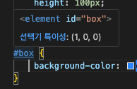

# HTML & CSS

---

## ✅ Shortcuts

- `!` + `tab` : html 기본 템플릿 자동 생성
- `opt` + `shift` + `⬇︎` : 한줄 복사
- `tag 이름` + `tab` : tag 자동 완성 (예. `p` + `tab` ⇒ `<p></p>` )
- `lorem30` : lorem ipsum 자동 생성 (숫자 만큼 생성됨)
- `div#id` + `tab` ⇒ `<div id=”id”></div>`
- `div.class` + `tab` ⇒ `<div class=”class”></div>`
- `input:checkbox` + `tab` ⇒ `<input type=”checkbox”>`
- [emmet shortcut list](https://docs.emmet.io/cheat-sheet/)

## ✅ HTML : Good to know

- `h1` 태그는 페이지 당 주로 한번만 사용, `h1` 태그에는 주로 로고 삽입(예. 네이버)
- 사이트의 주 목적은 수익 창출. 수익이 많으려면 유저가 많아야 하는데,검색 노출 잘되려면, `html` 코드가 잘 짜여져 (최적화 되어) 있어야 한다 (갖춰진 태그들을 잘 활용) → [SEO (Search Engine Optimization)](https://developers.google.com/search/docs/fundamentals/seo-starter-guide#:~:text=SEO%E2%80%94short%20for%20search%20engine,site%20through%20a%20search%20engine.)
- Convention : custom attribute 만들려면 앞에 data prefix를 붙이자! (예. `data-test=”test”`)
- basic tags :
    - `<abbr>` : 줄임말
    - `<figure>` : 주로 이미지가 들어가고 이미지를 설명하는 `<figcaption>`도 함께 활용 (`figcaption` 사용하면 `img` 요소의 `alt` attribute 불필요)
- semantic tags :
    - `<header>` : 페이지 가장 상단
    - `<nav>` : 주로 `<header>` 안에 있고, `ul>li` 태그가 포함됨
    - `<section>` : `h1`은 들어가면 안되고, 하나 이상의 `h` 태그가 들어가야 한다
    - `<main>` : 페이지당 1번만 사용해야 한다 (`header` & `footer` 제외한 모든 요소는 `main` 안에 들어감)
    - `<aside>` : 사이드에 주로 배치함 (예. 광고 배너)
    - `<article>` : 독립적으로 배포 가능하거나 재사용할 수 있는 콘텐츠를 묶는 영역
    - `<footer>` : 페이지 가장 하단
- form tags :
    - `<input>` 태그는 주로 `<label>` 태그와 함께 사용
    - `<button></button>` 은 `type=”submit”` attribute가 자동으로 들어가있어서, 제출할 게 아니라면 `<button type=”button”></button>`을 사용해야함 (단축키 : `btn:b` + `tab`)
- Inline & Block
    - `` 와 `<input>` 태그는 inline 이지만 width, height 등 적용 가능
- WAI-ARIA (Web Accessibility Initiative's Accessible Rich Internet Applications) : 스크린리더가 브라우저를 읽을 때 각 요소가 어떤 역할을 하는지 무슨 의미로 존재하는지 알 수 있도록 하기 위해 만들어진 기술
    - `aria-role`, `aria-label`, `aria-describedby` 등의 속성이 있음
    - `tabindex="0"` : Makes an element focusable within sequential keyboard navigation
        - `tabindex` 는 보통 `0` 또는 `-1` 값만 사용
    

## ✅ CSS : Good to know

- 태그 상속
    - 부모가 자식에게 `font style`(서체, 크기, 자간, 행간 등)을 물려주고, 자식은 부모에게 `height` 값을 물려준다
        - 따라서, `height` 설정은 부모에게 직접하지 않고, 자식에게만 설정하고 부모의 `height` 은 자동으로 자식의 `height`의 합계를 물려받게 한다 (예. 자식1 height : 200px + 자식2 height : 200px = 부모 height : 400px)
- inline 방식은 사용하지 않는 게 좋음 : 코드 복잡해지면 유지보수 어려워짐
    - 외부 방식을 사용하자!!
- css selector 우선순위
    - 일반 태그 (예. `p`, `div`) : 1점
    - 클래스 (예. `.box`) 또는 속성 (예. `[name=”box”]`) : 10점
    - 아이디 (예. `#box`) : 100점
    - 점수 조합 :
        - 앞에 일반 태그를 붙이면 1점 플러스됨
            - 예. `p.box` 또는 `p[name=”box”]` : 11점
        - 클래스 여러개 연속적으로 조합
            - 예. `.box-1.box-2.box-3.box-4` : 40점
        - 부모 자식 조합
            - 예. `#color_box .bg` : 110점
    - css 파일에서 selector에 hover 해보면 확인 가능
        
        
        
    - 아이디 selector 또는 `!important` 는 가급적 지양하는 것이 좋음
        - 지양 이유 : 우선순위 충돌, 디버깅 어려움, 프로젝트 관리 어려움, 스타일 변경 어려움
- CSS Nesting
    
    ```css
    .list {
    
        .box {
            background-color: black;
        }
    
        /* & 는 '나' 라는 뜻임 */
        &:hover {
    
        }
    
        > li:nth-child(3) {
            background-color: orange;
        }
    
        > .menu {
    
        }
    }
    ```
    
    - nesting으로 작성 가능
    - & : ampersand → ‘나’ 라는 뜻임 (`.list:hover` = `&:hover`)
- `margin`
    - 컨텐츠가 1층에 있을 때만 사용할 수 있음 (`float`, `position absolute` 등은 적용 안됨)
    - `margin: 0 auto;` → 가로 기준 가운데 정렬
    - `margin: 0 30px;` = `margin-inline: 30px;`
    - `margin: 30px 0;` = `margin-block: 30px;`
    - `margin-inline` 이 더 깔끔하고 더 많이 사용함
    - `padding` 도 동일하게 `padding-inline` 과 `padding-block`이 있음
- `box-sizing`
    - 예를 들어, 박스의 `width:200px; height:200px;` 로 설정하고 `border-width:5px;` 인 경우, `border-width` 가 더해져서 `width:210px; height:210px;` 이 되어버림
    - 이런 이슈를 방지하기 위해 `box-sizing:border-box;` 를 사용함
        - `width` & `height` 크기를 200px x 200px 로 고정
- `float`
    - 새로로 배치된 블럭 요소를 가로로 배치 시키기 위해 사용함
    - `float` 을 사용한 요소는 2층으로 올라감
    - 문제점 : 부모에 `height`이 없는 경우, 화면에 표시되지 않음. `p` 요소를 새로 많들어서 `clear:both;` 로 해결 가능 → 번거로움
    - 요즘은 잘 사용하지 않음, `flex`를 더 많이 활용함
- `position`
    - 구분
        
        
        |  | `relative` | `absolute` | `fixed` |
        | --- | --- | --- | --- |
        | 층수 | 1층 | 2층 | 2층 |
        | 기준점 | 자신 | 부모 | 브라우저 |
        | 가운데 정렬 | margin: 0 auto | 공식 | 공식 |
        | 사용 예시 | 기준점을 잡아주기 위해 | 독립적 요소 | 화면 고정 |
        | 필수 입력값 | 없음 | ×축 1개 / y축 1개 | x축 1개 / y축 1개 |
    - `position: relative` 로 위치를 조정하는 경우, 화면에서 요소를 찾기가 어려워서, 위험함 → `position: relative` 는 주로 `position: absolute`의 기준점을 잡아주기 위해 사용함
    - `position: absolute` 가운데 정렬 공식:
        
        ```css
        position: absolute;
        left: 50%;
        top: 50%;
        translate: -50% -50%;
        ```
        
    - `position: fixed`
        - `transform`, `filter`, `perspective`, `will-change`, `backdrop-filter` : 이러한 속성들은 GPU로 작동하고 containing block을 새롭게 만들기 때문에, 이러한 속성이 부모 요소에 포함된 경우 `position fixed` 가 원하는대로 안 움직임
            - `margin-left: -200px; margin-top: -125px;` → 이런식으로 `margin`을 활용하여 해결 가능
    - `z-index`
        - 어떤 요소가 위에 올라가는지를 설정하는 속성
- `hover`
    - `hover`는 부모에게 주는 것이 안전하다
    - 예. `footer:hover > p` 가 `footer: > p:hover` 보다 더 안전
- `flex`
    - main 축과 sub 축이 있음
    - `flex-direction:row` (default) → 가로가 main, 새로가 sub
        - `justify-content` → 가로 정렬
        - `align-items` → 새로 정렬
    - `flex-direction:column` → 새로가 main, 가로가 sub
        - `justify-content` → 새로 정렬
        - `align-items` → 가로 정렬
- reset.css
    - [https://meyerweb.com/eric/tools/css/reset/](https://meyerweb.com/eric/tools/css/reset/)
    - 브라우저마다 기본적으로 요소에 적용되는 CSS 스타일을 통일하여 웹 페이지 디자인의 일관성을 유지하고 레이아웃을 정확하게 제어하기 위한 기술

## 네이밍 규칙:

- `kebab-case` : `ease-in-out-bounce`
    - 계층 관계를 나눠야 할 때
- `snake_case` : `ease_in_out_bounce`
    - 더블 클릭하면 한번에 다 선택됨
    - css 네이밍, 파일명에 많이 사용함
- `camelCase` : `easeInOutBounce`
    - JS에서 가장 많이 사용함
- `PascalCase` : `EaseInOutBounce`
    - 앞에 대문자 + camelCase
    - JS에서 많이 사용함 (특히 React)
    - constructor(생성자)